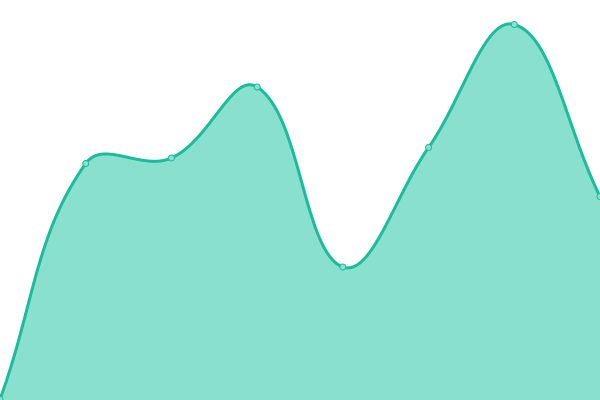
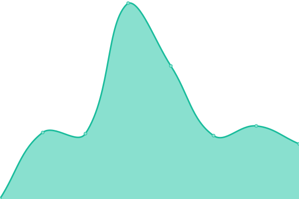

# [📈 Live Status](https://killbillsdev.github.io/StatusPage): <!--live status--> **🟨 Degraded performance**

This repository contains the open-source uptime monitor and status page for [KillBills](https://www.killbills.co/), powered by [Upptime](https://github.com/upptime/upptime).

With [Upptime](https://upptime.js.org), you can get your own unlimited and free uptime monitor and status page, powered entirely by a GitHub repository. We use [Issues](https://github.com/killbillsdev/StatusPage/issues) as incident reports, [Actions](https://github.com/killbillsdev/StatusPage/actions) as uptime monitors, and [Pages](https://killbillsdev.github.io/StatusPage) for the status page.

<!--start: status pages-->
<!-- This summary is generated by Upptime (https://github.com/upptime/upptime) -->
<!-- Do not edit this manually, your changes will be overwritten -->
<!-- prettier-ignore -->
| URL | Status | History | Response Time | Uptime |
| --- | ------ | ------- | ------------- | ------ |
|  [KillBills Website [ https://killbills.co ]](https://killbills.co) | 🟩 Up | [kill-bills-website-https-killbills-co.yml](https://github.com/killbillsdev/StatusPage/commits/HEAD/history/kill-bills-website-https-killbills-co.yml) | 

 347ms
     
 | 

<a href="https://status.killbills.co/history/kill-bills-website-https-killbills-co">100.00%</a>
    

|  [KillBills Stores Map [ https://maps.killbills.co ]](https://maps.killbills.co) | 🟩 Up | [kill-bills-stores-map-https-maps-killbills-co.yml](https://github.com/killbillsdev/StatusPage/commits/HEAD/history/kill-bills-stores-map-https-maps-killbills-co.yml) | 

 169ms
     
 | 

<a href="https://status.killbills.co/history/kill-bills-stores-map-https-maps-killbills-co">100.00%</a>
    

|  [KillBills Partner's App [ https://partners.killbills.co ]](https://partners.killbills.co) | 🟩 Up | [kill-bills-partner-s-app-https-partners-killbills-co.yml](https://github.com/killbillsdev/StatusPage/commits/HEAD/history/kill-bills-partner-s-app-https-partners-killbills-co.yml) | 

 258ms
     
 | 

<a href="https://status.killbills.co/history/kill-bills-partner-s-app-https-partners-killbills-co">100.00%</a>
    

|  KillBills Receipts Ingestion | 🟩 Up | [kill-bills-receipts-ingestion.yml](https://github.com/killbillsdev/StatusPage/commits/HEAD/history/kill-bills-receipts-ingestion.yml) | 

 2010ms
     
 | 

<a href="https://status.killbills.co/history/kill-bills-receipts-ingestion">99.28%</a>
    

|  KillBills Transactions Ingestion | 🟩 Up | [kill-bills-transactions-ingestion.yml](https://github.com/killbillsdev/StatusPage/commits/HEAD/history/kill-bills-transactions-ingestion.yml) | 

 1203ms
     
 | 

<a href="https://status.killbills.co/history/kill-bills-transactions-ingestion">99.36%</a>
    

|  KillBills Matching | 🟩 Up | [kill-bills-matching.yml](https://github.com/killbillsdev/StatusPage/commits/HEAD/history/kill-bills-matching.yml) | 

 2111ms
     
 | 

<a href="https://status.killbills.co/history/kill-bills-matching">99.36%</a>
    

|  KillBills Stores List API | 🟨 Degraded | [kill-bills-stores-list-api.yml](https://github.com/killbillsdev/StatusPage/commits/HEAD/history/kill-bills-stores-list-api.yml) | 

 21856ms
     
 | 

<a href="https://status.killbills.co/history/kill-bills-stores-list-api">61.46%</a>
    

|  KillBills Receipt Retrieval API | 🟩 Up | [kill-bills-receipt-retrieval-api.yml](https://github.com/killbillsdev/StatusPage/commits/HEAD/history/kill-bills-receipt-retrieval-api.yml) | 

 2821ms
     
 | 

<a href="https://status.killbills.co/history/kill-bills-receipt-retrieval-api">100.00%</a>
    

<!--end: status pages-->

[**Visit our status website →**](https://killbillsdev.github.io/StatusPage)

## 📄 License

- Powered by: [Upptime](https://github.com/upptime/upptime)
- Code: [MIT](./LICENSE) © [Anand Chowdhary](https://anandchowdhary.com), supported by [Pabio](https://pabio.com)
- Data in the `./history` directory: [Open Database License](https://opendatacommons.org/licenses/odbl/1-0/)
